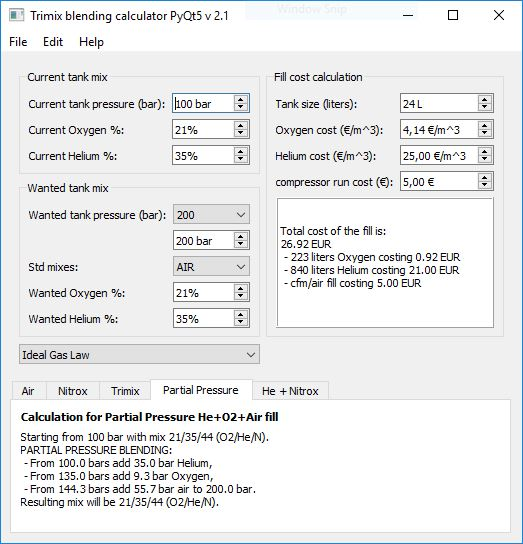

# FillCalc2
FillCalc2.py is an auxiliary tool included in the [pydplan](https://github.com/eianlei/pydplan) for interactive gas mixing calculations.
It will calculate how to blend a technical scuba diving gas mix given the current mix you have in tank and what you want. Several blending methods are available.

FillCalc2 is a further development of an earlier project at github:
[trimix-fill](https://github.com/eianlei/trimix-fill)

But instead of using TkInter as in trimix-fill, FillCalc2.py uses PyQt5 as graphics library and is more interactive.

# FillCalc2 installation
The tool requires two Python files to run:

file | purpose
------------ | -------------
FillCalc2.py | the PyQt5 GUI defined here, call this module to start the app
tmx_calc.py | calculations and formulas, reusable with no dependecies to UI

You get these if you clone or pull the entire [pydplan](https://github.com/eianlei/pydplan). Or just download these two if you are only interested in this app.

You also need PyQt5 in Python3 environment of course.

# FillCalc2 usage
start the tool by

    python FillCalc2.py
And you should see the main window

Now simply fill into the widgets the  current and wanted tank mixes.
Then select the tab of your choise for a fill method:

tab label | fill method
------------ | -------------
Air | You are topping the tank with plain air. Obviously you will not then get the mix you maybe wanted. The app calculates what you will get.
Nitrox |  You are topping the tank with Nitrox CFM. Obviously you will not then get more Helium to the tank, but the app tries to calculate the O2% inflow to match your O2% target. You get error if you want something that cannot be done.
Trimix | You are topping the tank with Trimix CFM. Here we assume you have only one mixing chamber and only one O2 sensor.
Partial Pressure | Your are doing a partial pressure (decanting) fill. First fill in Helium, then Oxygen, finally top with air.
He + Nitrox | You are decanting first pure Helium, then top with Nitrox CFM.

If the mix you want is possible to make, then under the tab you will see the instructions how to make it. Otherwise you get an error.

The application immediately recalculates when you change anything in the GUI widgets. The calculation is simple and you should not notice any delay. The Spinbox widgets can be used by either entering values from keyboard, or then increase/decrease value by clicking up/down arrows.

You can try to "simulate bleeding" your tank, if you are not getting the mix you want. Simply decrease the current tank pressure by as much as you would then be bleeding actually, and you might find a solution.

The application assumes that for CFM fills the following Oxygen and Helium flows cannot be exceeded:
- Oxygen max 36%, as your compressor can explode.
- Helium max 32% as your compressor can overheat

On the right hand side there is panel that calculates the cost of your fill.

The menu at the top of the main window is placeholder for future enhancements, and currently does nothing.

# target users
The application is intended for certified [Trimix](https://en.wikipedia.org/wiki/Trimix_(breathing_gas)) gas blenders, who [blend gases](https://en.wikipedia.org/wiki/Gas_blending_for_scuba_diving) for [technical scuba diving](https://en.wikipedia.org/wiki/Technical_diving).

It is assumed that anyone daring to use this application knows what they are doing.

# disclaimers
Use this application at your own risk, the author provides no guarantees about the correctness of the application, and assumes no liability for the use of it for any purpose!

* In no event should you consider blending breathing gases without proper training!
* In no event should you consider scuba diving with mixed gases without proper training!
* Ignoring these warnings can cause your **death** or **serious and permanent injuries**!

# Supported platforms
The script has been tested on
* Windows 7, and 10 with Python 3.6.x and 3.7.x
* Linux: Red Hat 6.8, Ubuntu 18.4 LTS  with Python 3.6.x
* It probably also works on MAC, but I have not tested this.
* Will not run on Android as such. But an Android app might be there in the future...

## Install Python
Latest Python version can be downloaded for free from [www.python.org](https://www.python.org/downloads/)

Python is available for Windows, Linux/UNIX, Mac OS X.

## Python 2 not supported
Script is written for Python 3 and will not work as such in older Python versions.

## PyQt5
GUI depends on PyQt5, you will need to install pyqt5 to your Python.

# Unit system
* Metric and EU units, Imperial units not supported
* decimal separator is dot "." not comma ","
* Currently only bar can be used as pressure unit, PSI not supported
* Gas mixes as percentages
* Tank size in liters (cu-ft not supported)

# Gas laws used for calculation
The calculation formulas are based on the [ideal gas law](https://en.wikipedia.org/wiki/Ideal_gas_law).
There are more accurate models such as the [Van der Waals equation](https://en.wikipedia.org/wiki/Van_der_Waals_equation).

Adiabatic heating and cooling due to compression and decompression of gases is not taken into account.
